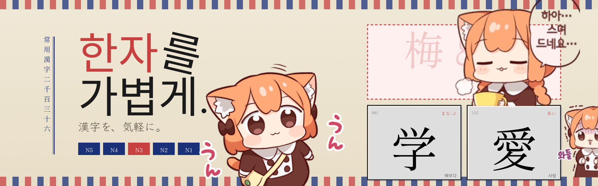
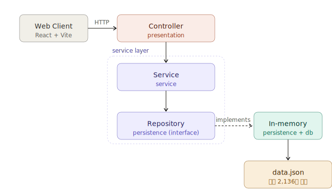

<div align="center">



<h1>
  
</h1>

<p>
  <b>상용한자 2,136자를 배로 갚아드리는 엔진.</b>
  <br />
  <sub>Kotlin · Spring Boot · In-memory</sub>
</p>

<br />

<p>
  <a href="#-api-스펙"></a>
  <a href="#-실행-방법"></a>
  <a href="https://github.com/mindaaaa/hanzawa-kanji-web"></a>
</p>

<br />

<table align="center">
  <tr>
    <td align="center"><b>2,136</b><br/><sub>상용 한자</sub></td>
    <td align="center"><b>1</b><br/><sub>API 엔드포인트</sub></td>
    <td align="center"><b>In-memory</b><br/><sub>저장 방식</sub></td>
    <td align="center"><b>40324</b><br/><sub>기본 포트</sub></td>
  </tr>
</table>

</div>

---

## 📡 API 스펙

기본 포트: `40324` (`application.yaml`에서 변경 가능)

<br />

<details>
<summary><b><code>GET</code> <code>/api/v1/hanzawa-kanji</code> — 한자 목록 조회</b></summary>

<br />

**Query Parameters**

| 파라미터 | 타입                 | 설명                                                  |
| :------- | :------------------- | :---------------------------------------------------- |
| `mode`   | `NORMAL` \| `RANDOM` | `NORMAL`: id 순서 / `RANDOM`: 셔플 (기본 `NORMAL`)    |
| `limit`  | `Int`                | 페이지 크기 (기본 10)                                 |
| `cursor` | `Int`                | 다음 페이지 시작 id. 응답의 `cursor` 값을 그대로 전달 |
| `quizId` | `String`             | `RANDOM` 모드에서 동일 세션의 셔플 시드 유지용        |

**Response**

```json
{
  "items": [
    {
      "id": 1,
      "value": "亜",
      "korean": [{ "kun": "버금", "on": "아" }],
      "kunyomi": [],
      "onyomi": ["ア"],
      "traditionalForm": "亞"
    }
  ],
  "cursor": 11,
  "totalCount": 2136
}
```

> 💡 `cursor`가 `null`이면 마지막 페이지입니다.

</details>

---

## 💻 주요 기능

<div align="center">

<table>
<tr>
<td width="50%" valign="top">

### ① 커서 기반 페이지네이션

응답의 `cursor`를 다음 요청에 그대로 전달하는 방식.

- 클라이언트 무한 스크롤과 매끄럽게 이어짐
- `null` 반환 시 종료 신호

</td>
<td width="50%" valign="top">

### ② RANDOM 모드 시드 유지

`quizId`를 셔플 시드로 사용해 **동일 `quizId`면 동일 순서**를 보장.

- 같은 `quizId` = 같은 순서
- 여러 페이지에 걸친 요청에도 보기 충돌 없음

</td>
</tr>
<tr>
<td width="50%" valign="top">

### ③ In-memory 저장소

기동 시 `data.json`을 메모리에 로드.

- **DB 불필요** — 단일 프로세스로 즉시 기동
- 응답 경로에 I/O 없음

</td>
<td width="50%" valign="top">

### ④ 의존성 역전

`KanjiService`는 구현체가 아닌 `KanjiRepository` 인터페이스에 의존.

- 구현체는 `persistence` 패키지에 격리
- 저장소 교체 시 서비스 계층 수정 불필요

</td>
</tr>
</table>

</div>

---

## 🛠️ 기술 스택

<div align="center">

### Core


### Storage & Testing


### Tooling


</div>

---

## 🏛️ 아키텍처

<div align="center">



</div>

> [!NOTE]
> `presentation` / `service` / `persistence` / `db` 4개 패키지로 구성됩니다.  
> **Controller(`presentation`)** → **Service(`service`)** → **Repository 인터페이스(`persistence`)** → **In-memory 구현체(`persistence`)** → **데이터 로더(`db`)** 순의 단방향 흐름입니다.  
> `db/KanjiDataSource`가 기동 시 `data.json`을 메모리에 로드합니다.

---

## 🚀 실행 방법

### ① 요구사항

- **JDK 17**

### ② 개발 서버

```bash
./gradlew bootRun
```

> 기본 `http://localhost:40324`에서 기동합니다.

### ③ 테스트

```bash
./gradlew test
```

### ④ 빌드

```bash
./gradlew build
```

---

## 📂 디렉터리 구조

```
src/main/kotlin/com/mindaaaa/hanzawakanji/
├── Application.kt
├── Configuration.kt
├── db/                            # data.json 로더 + Kanji 도메인 모델
│   ├── KanjiDataSource.kt
│   └── model/
│       └── Kanji.kt
├── persistence/                   # Repository 인터페이스 + in-memory 구현체
│   ├── KanjiRepository.kt
│   ├── KanjiRepositoryImpl.kt
│   └── model/
│       └── Mode.kt                # enum { NORMAL, RANDOM }
├── presentation/                  # Controller + CORS 설정
│   ├── KanjiController.kt
│   └── WebConfiguration.kt
└── service/                       # Service + DTO
    ├── KanjiService.kt
    └── dto/
        ├── ListRequestDto.kt
        └── ListResponseDto.kt

src/main/resources/
├── application.yaml
└── data.json                      # ⚠️ .gitignore 대상 — 직접 준비 필요
```

<br />

---

## 👩‍💻 데이터

> [!IMPORTANT]
> `data.json`은 `.gitignore` 대상으로 저장소에 포함되어 있지 않습니다.  
> 클론 후 아래 스키마에 맞춰 **`src/main/resources/data.json`** 경로에 직접 추가해야 합니다.

### 위치

```
src/main/resources/data.json
```

### 루트 형태

최상위는 `Kanji` 객체의 **배열**입니다.

```json
[
  { "id": 1, "value": "亜", "...": "..." },
  { "id": 2, "value": "哀", "...": "..." }
]
```

### 스키마

| 필드              | 타입               | 필수 | 설명                           |
| :---------------- | :----------------- | :--: | :----------------------------- |
| `id`              | `Int`              |  ✔️  | 고유 id (커서 페이지네이션 키) |
| `value`           | `String`           |  ✔️  | 한자 본체 (예: `亜`)           |
| `korean`          | `Array<{kun, on}>` |  ✔️  | 한국어 훈·음 쌍 배열           |
| `korean[].kun`    | `String`           |  ✔️  | 한글 훈 (예: `버금`)           |
| `korean[].on`     | `String`           |  ✔️  | 한글 음 (예: `아`)             |
| `kunyomi`         | `Array<String>`    |  ✔️  | 일본어 훈독 (없으면 `[]`)      |
| `onyomi`          | `Array<String>`    |  ✔️  | 일본어 음독 (없으면 `[]`)      |
| `traditionalForm` | `String \| null`   |  ✔️  | 정자체 (없으면 `null`)         |

> `korean`, `kunyomi`, `onyomi`는 값이 없어도 **빈 배열 `[]`로 필드 자체는 존재**해야 합니다.  
> Jackson이 `List` 타입으로 역직렬화하므로 키 누락 시 기동 실패합니다.

### 예시 (1 항목)

```json
{
  "id": 1,
  "value": "亜",
  "korean": [{ "kun": "버금", "on": "아" }],
  "kunyomi": [],
  "onyomi": ["ア"],
  "traditionalForm": "亞"
}
```

### 규모

- 현재 기준 **2,136자**
- 일본 상용한자(常用漢字) 전체 기준

---

## 🔗 관련 저장소

<div align="center">

<table>
<tr>
<td align="center" width="50%">

### ⚙️ Backend API (현재 저장소)

**Kotlin + Spring Boot**
<br /><sub>한자 데이터 & 퀴즈 서빙</sub>

</td>
<td align="center" width="50%">

### 🎨 [Frontend Web](https://github.com/mindaaaa/hanzawa-kanji-web)

**React + Vite**
<br /><sub>상용한자 퀴즈 웹앱</sub>

</td>
</tr>
</table>

</div>

---

<div align="center">

<sub>
  <b>— 한 글자도 놓치지 않습니다. —</b>
</sub>

</div>
